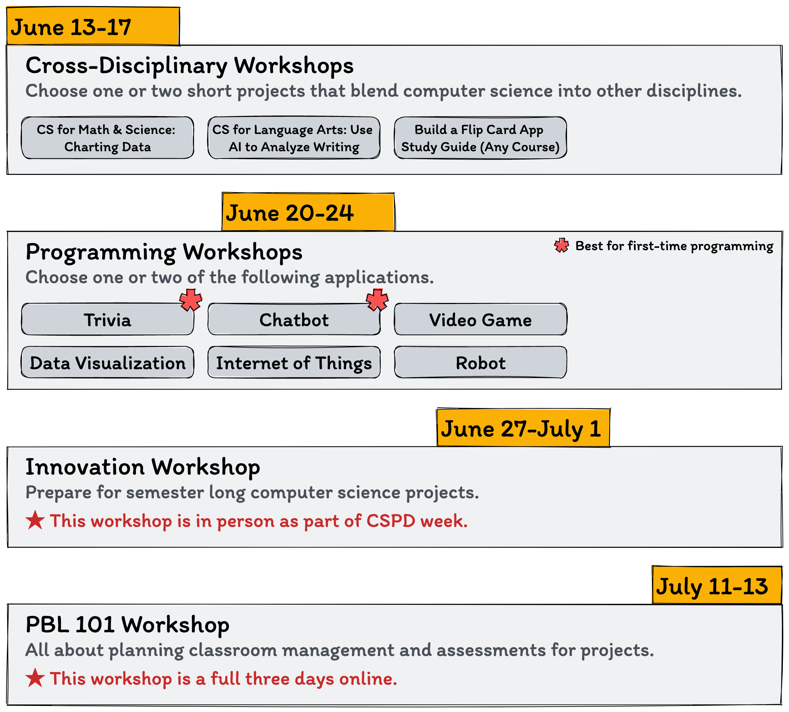

# Computing by Design 2022 🚀

## Welcome to Our 2022 Online Summer Workshop Series!



 (1).png>)

### Choose one or more workshops to meet your needs.&#x20;

👈 Find more details on each workshop through the navigation on the left.


### Register 👉 [Here](https://iu.co1.qualtrics.com/jfe/form/SV\_43h61F7ieHxzRC6)


### Teacher Stipends:heavy\_dollar\_sign:&#x20;

**Teachers will be provided stipends on the following schedule each summer.**

* $250 dollars per participation in a one-week workshop (Programming WS, PBLWorks WS, Cross-Discipline WS)

✱ The CxD innovation workshop at CSPD Week is not included in stipends distributed by us, but they are offered through [**CSPD**](https://indiana.csteachers.org/stories/save-the-date-for-indiana-cspd-week-2022).

The maximum total stipend in a summer workshop series will not exceed $1000 per teachers. In order to receive a stipend for the PBLWorks Workshop the teacher must also participate in at least one other workshop to ensure sufficient coverage of computer science content.&#x20;

**The following are required to receive the stipend for each workshop.**

* Participation in all live online sessions for the given workshop
* Participation in the online Slack community
* Complete associated surveys
* Submission of a final deliverable that demonstrates competency in the workshop content
