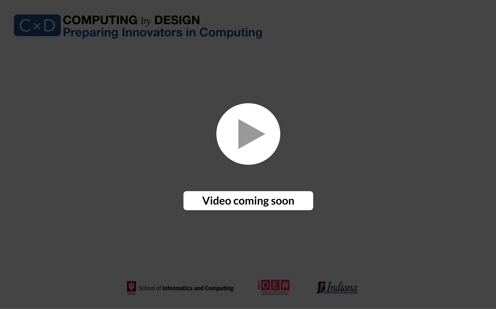

# Build a Flash Card App Study Guide for Any Course

### **Welcome and Getting Started**

### **Project Guide**

While the project guide, linked below, can be used as-is in your classroom, you will likely want to adapt the instructions to meet the specific needs of your course context and objectives. Feel free to use any portion of the material in your own documentation.



### Workshop Agenda


#### All posted times are Eastern Daylight Time (EDT)


1. **Attend the live Zoom session on Monday June 13, 2:30 pm - 3:30 pm** **EDT ⏰**\
   ****The Zoom link will be provided in Slack.
2. **Follow the project guide and complete an example project to meet your student expectations, as you construct any adapted project instructions documents you will use for your course.**\
   ****Use our Slack channel `#short-project-build-a-flip-card-study-app` to post questions/answers, to share things you have created or to share additional resources you have found.
3. **Attend the live Zoom session on Thursday June 16, 2:30 pm - 3:30 pm EDT ⏰**\
   ****The same Zoom link will be used for this meeting
4. **Continue posting questions and sharing success in Slack `#`**`short-project-build-a-flip-card-study-app` **** as you complete your project example and adapted project instructions.
5. **Submit your project example and adapted project instructions for the workshop deliverable by July 11, 2022.  🎉**
